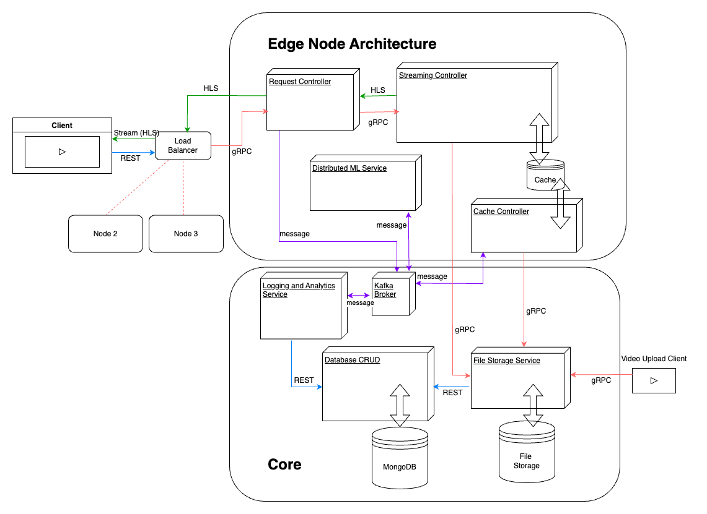

# Telco-Edge CDN for Latency-Sensitive Video Streaming


# System design



# Core

## Grafana dashboards

Here are the origins of provisioned dashboards:

|Dashboard           |link|
|MinIo Dashboard     |https://grafana.com/grafana/dashboards/13502-minio-dashboard/|
|MinIo Dashboard     |https://grafana.com/grafana/dashboards/13502-minio-dashboard/|
|Video uploader      |https://github.com/Kludex/fastapi-prometheus-grafana|
|Request controller  |https://github.com/Kludex/fastapi-prometheus-grafana|
|Kafka               |https://grafana.com/grafana/dashboards/18276-kafka-dashboard/|

## core Kubernetes deployment

### Bring up cluster

```bash
kubectl apply -f core/k8s/
```

### Clean cluster

Cluster can be cleaned with script. This script deletes all pods and related configs from kubernetes in one namespace. Default value for 'namespace' is 'default' and core is deployed to 'default' namespace.
```bash
sh clean-k8s-namespace.sh <namespace>
```

## Update kubernetes cluster with new containers

```bash
dockcer compose push  # On development machine

# On kubernetes controller node
git pull
sh core/update_k8s_pods.sh
```


# Kubernetes for Edge Services

1. Install Prerequisites
   - Install kubectl on your computer
   - Install minikube

2. Start Minikube
```bash
minikube start
```

3. Enable Ingress Addon
```bash
minikube addons enable ingress
```

4. Deploy Kubernetes Resources
```bash
kubectl apply -f k8s/
```

5. To Clear and Redeploy (if needed)
```bash
# Delete all resources in k8s directory
kubectl delete -f k8s/

# Wait for resources to be fully deleted

# Reapply the configuration
kubectl apply -f k8s/
```

6. Open tunnel
```bash
minikube tunnel
```

7. Access Dashboards
   - MinIO Dashboard: ```http://localhost/minio```
   - Grafana Dashboard: ```http://localhost/grafana```


# Integration tests

## Setup

1. Create and activate a Python virtual environment:
```sh
python -m venv .venv
source .venv/activate 

pip install -r requirements.txt
```

## Run test with docker compose

```bash
# All test cases
pytest -s -v
# invidual test cases
pytest -s -v  test/core/file-storage-service/test_file_storage_service.py
```
## Run test with kubernetes deployment

```bash
# All test cases
TEST_ENV=kubernetes pytest -s -v
# invidual test cases
TEST_ENV=kubernetes pytest -s -v  test/core/file-storage-service/test_file_storage_service.py
```
